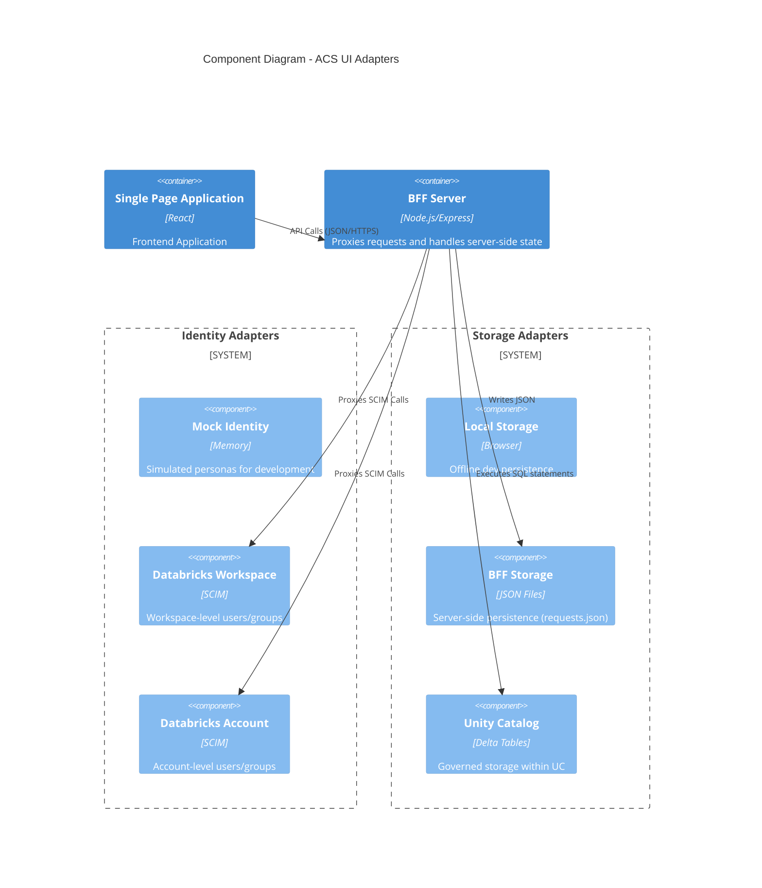

# Backend Datastore Schema Documentation

This document outlines the required schemas for the various backend datastores supported by the Access Control System.

## 1. Architecture Overview (C4 Component)

The system abstracts the Identity Providers (IdP) and Storage Mechanisms via pluggable adapters. This diagram illustrates how the frontend components interact with these configurable adapters.



## 2. Core Data Models (JSON/YAML)

All adapters communicate using a unified set of interfaces. For the **BFF (JSON)** and **Mock** adapters, the following structure represents an access request.

### Access Request Schema
Represents the **request metadata**, stored in `server/data/requests.json`.

```json
{
  "id": "1711629445",
  "status": "PENDING",          // PENDING | APPROVED | DENIED | EXPIRED | REVOKED
  "createdAt": "2024-03-28T10:00:00Z",
  "updatedAt": "2024-03-28T11:00:00Z",
  "requesterId": "user_alex",   // ID of the user who created the request
  "principals": [               // List of users/groups getting access
    {
      "id": "user_alex",
      "name": "Alex Analyst",
      "type": "USER"
    }
  ],
  "objects": [                  // References to data objects involved
    {
      "id": "main.finance.transactions",
      "type": "TABLE",
      "catalog": "main",
      "schema": "finance",
      "table": "transactions"
    }
  ],
  "permissions": ["SELECT"],    // Privileges requested (e.g., SELECT, MODIFY)
  "justification": "Need access for quarterly audit",
  "approvals": [                // Audit trail of decisions
    {
      "userId": "manager_sarah",
      "status": "APPROVED",
      "timestamp": "2024-03-28T10:30:00Z",
      "comment": "Approved for audit purpose"
    }
  ]
}
```

---

## 3. Unity Catalog Schema (Delta)

When using `UNITY_CATALOG` storage mode, requests are persisted as Delta tables. The system uses a **SQL Warehouse** to execute these commands.

### Delta Table: `access_requests`
This table acts as the source of truth for all workflows.

```sql
CREATE TABLE IF NOT EXISTS system.access_control.access_requests (
  id STRING NOT NULL,           -- Primary Key
  status STRING,                -- PENDING, APPROVED, etc.
  requester_id STRING,
  justification STRING,
  created_at TIMESTAMP,
  updated_at TIMESTAMP,
  request_json STRING,          -- Full serialized record (JSON) for auditability
  principals_json STRING,       -- Snapshot of target principals at point of request
  objects_json STRING           -- Snapshot of target objects
) USING DELTA
PARTITIONED BY (status);
```

### Configuration Required:
- **Host**: Databricks workspace URL.
- **Token**: PAT or Service Principal Secret.
- **SQL Warehouse ID**: The ID of the warehouse used to execute DDL/DML.
- **Catalog/Schema**: Namespace where meta-tables reside.

---

## 4. Identity Mapping

The system supports multiple identity sources, mapped via the `IdentityService`.

| Type | Source | Auth Method | Description |
| :--- | :--- | :--- | :--- |
| `MOCK` | Local Memory | Session Simulation | Zero-config, pre-populated personas. |
| `DATABRICKS_WORKSPACE` | Workspace SCIM | PAT / OAuth | Users/groups specific to a single workspace. |
| `DATABRICKS_ACCOUNT` | Account SCIM | PAT / OAuth | Global users/groups across all workspaces. |

### User Profile Schema (`/api/scim/v2/Me`)
Fetched via the BFF proxy to ensure identity consistency.
```json
{
  "id": "12345",
  "userName": "alex@example.com",
  "displayName": "Alex Analyst",
  "emails": [{ "value": "alex@example.com", "primary": true }],
  "groups": [
    { "display": "analysts", "value": "group_999" }
  ]
}
```
