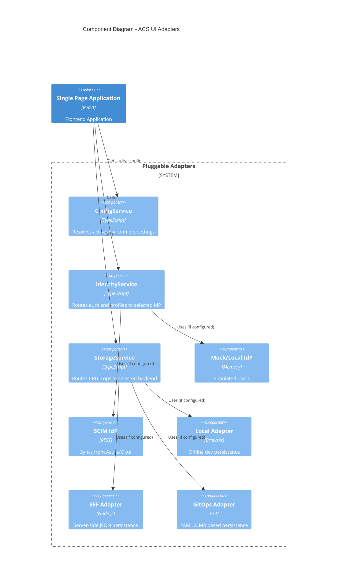

# Backend Datastore Schema Documentation

This document outlines the required schemas for the various backend datastores supported by the Access Control System.

## 1. Architecture Overview (C4 Component)

The system abstracts the Identity Providers (IdP) and Storage Mechanisms via pluggable adapters. This diagram illustrates how the frontend components interact with these configurable adapters.



## 2. Core Data Models (YAML)

All adapters communicate using a unified set of interfaces. For **Git (GitOps)** and **LocalStorage/Volatile** adapters, the following YAML structure is used for centralization and auditability.

### Access Request Schema
Represents the **request metadata**, stored centrally in the `/requests` directory in GitOps mode.

```yaml
id: "1711629445"
status: "APPROVED"         # PENDING | APPROVED | DENIED | EXPIRED | REVOKED
createdAt: "2024-03-28T10:00:00Z"
requester:                 # Clear requester identity
  id: "user_alex"
  name: "Alex Analyst"
objects:                   # References to data objects involved
  - id: "main.finance.transactions"
    permissions: ["SELECT"]
approvers:                 # List of individuals who approved
  - id: "manager_sarah"
    timestamp: "2024-03-28T10:30:00Z"
    comment: "Approved for audit purpose"
justification: "Need access for quarterly audit"
gitMetadata:
  branch: "req_1711629445"
  mrId: 101
  status: "MERGED"
```

---

## 2. RDBMS Schema (SQL)

For persistent storage in relational databases (Postgres, MySQL, SQL Server), the following table structure is recommended.

### Table: `access_requests`
| Column | Type | Description |
| :--- | :--- | :--- |
| `id` | `VARCHAR(64)` | Primary Key |
| `status` | `VARCHAR(20)` | Current lifecycle state |
| `created_at` | `TIMESTAMP` | ISO timestamp |
| `justification` | `TEXT` | User-provided justification |
| `request_blob` | `JSONB` / `TEXT` | The full JSON/YAML representation for extensibility |

### Table: `request_objects` (Normalization)
| Column | Type | Description |
| :--- | :--- | :--- |
| `request_id` | `VARCHAR(64)` | Foreign Key to `access_requests.id` |
| `object_id` | `VARCHAR(255)` | UC Full Name |
| `object_type` | `VARCHAR(32)` | catalog, schema, table, etc. |

---

## 3. Unity Catalog Schema (Delta)

When using `UNITY_CATALOG` storage, requests are stored as Delta tables within a governing catalog/schema (e.g., `system.access_control`).

### Delta Table: `requests`
```sql
CREATE TABLE IF NOT EXISTS system.access_control.requests (
  id STRING,
  status STRING,
  created_at TIMESTAMP,
  request_json STRING -- Full serialized record for future-proofing
) USING DELTA;
```

---

## 4. Git Repository Structure (Hierarchical YAML)

When using the `GIT` strategy, the repository reflects the Unity Catalog object hierarchy combined with centralized request tracking.

```text
/
├── .codeowners                   # Root codeowners (default)
├── requests/                     # Centralized request metadata
│   ├── 1711629445.yaml           # Metadata for request #1711629445
│   └── 1711630122.yaml
├── data_objects/                 # Hierarchical permissions (active state)
│   └── <catalog>/
│       └── <schema>/
│           └── <table_or_view>/
│               └── active.yaml   # Current active grants for this object
└── CODEOWNERS                    # Dynamically generated per branch
```

### active.yaml Example
```yaml
# Active grants for main.finance.transactions
permissions:
  SELECT:
    - principal: "user_alex"
      name: "Alex Analyst"
      grantedAt: "2024-03-28T11:00:00Z"
      requestId: "1711629445"  # Link back to metadata in /requests
```
