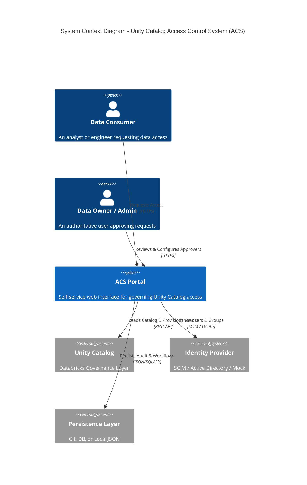
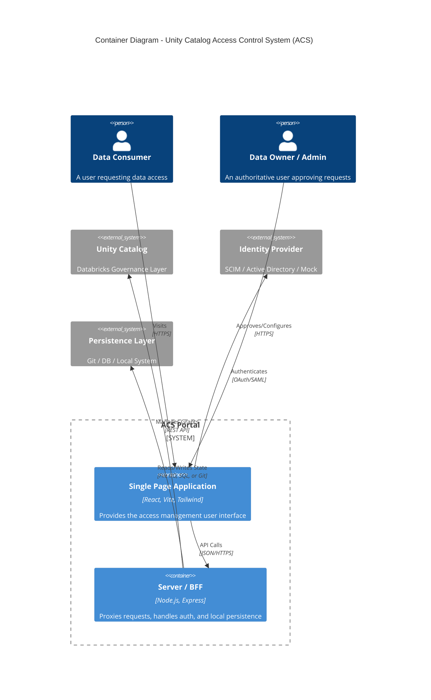

# ACS UI

A premium, standalone React application for managing Unity Catalog access requests.

## Architecture

Below are the C4 Model diagrams illustrating the design of the ACS UI system.

### System Context



### Container Diagram



## Features

- **Unity Catalog Browser**: Browse and select Catalogs, Schemas, Tables, Models, Volumes, and Compute resources.
- **Access Requests**: Submit requests for Users, Groups, or Service Principals with specific permissions.
- **Multi-Stage Approval**:
    - Supports multiple asset owners.
    - **Mandatory Governance**: A governance group must check every request.
    - **Unanimous Consent**: All owners + governance must approve.
- **Audit Logging**: Full audit trail of all requests and decisions.
- **Enterprise Authentication**:
    - **Databricks Login**: Secure direct authentication via Personal Access Token (PAT) or Username/Password.
    - **Cloud SSO**: Simulation for Google, Microsoft, and SAML (Mock).
- **Offline First**: All data is mocked and persisted locally (`localStorage`) by default.

## Prerequisites

- **Node.js** (v16 or higher)
- **npm** (v7 or higher)

## Installation

**IMPORTANT: You must install dependencies before running the project.**

1.  Clone or download this repository.
2.  Navigate to the project directory:
    ```bash
    cd unity-catalog-access-request-ui
    ```
3.  **Install dependencies (required):**
    ```bash
    npm install
    ```

> If you see an error like "command not found: vite" or "package 'vite' not found", it means you haven't run `npm install` yet.

## Running Locally (Development)

The application has two components: the React frontend (Vite) and the Backend-For-Frontend (BFF) Express server.

### 1. Start the BFF Server
```bash
cd server
npm install
npm run dev
```
The BFF server runs on `http://localhost:3001` by default.

### 2. Start the Frontend
Back in the project root:
```bash
npm run dev
```

Open your browser to `http://localhost:5173`.

> If you need to customize the BFF URL (e.g., for deployment), copy `.env.example` to `.env` and set `VITE_BFF_URL`.

## Building for Production

To create a static production build (which can be hosted on any static file server):

1.  Run the build command:
    ```bash
    npm run build
    ```
2.  The output files will be in the `dist/` directory.

To preview the production build locally:
```bash
npm run preview
```

## How to Demo

1.  **Login**: Use the "Sign in with Google" button to login as **Alice Johnson** (Requester).
2.  **Request**: Browse the catalog (e.g., `External Locations & Compute`) and request access to a resource like `GPU Cluster`.
3.  **Logout**: Switch users to the Approver role.
4.  **Approve**: Login as "Sign in with Microsoft" (**Carol CFO**).
    - Go to the **Approver** tab.
    - Use the **Persona Switcher** to approve as `Governance Team`.
    - Then approve as `Carol CFO` (Owner).
5.  **Audit**: Check the **Audit Log** tab to see the full history.

## Technology S
- **Framework**: React + Vite
- **Styling**: Vanilla CSS (CSS Variables, Glassmor
- **Icons**: Lucide React
- **Persistence**: [Localized & Pluggable Backend](BACKEND.md) (LocalStorage, RDBMS, Unity Catalog, GitOps)
